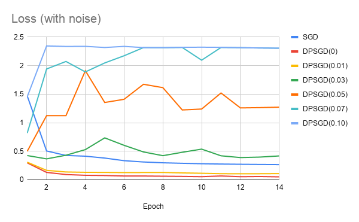
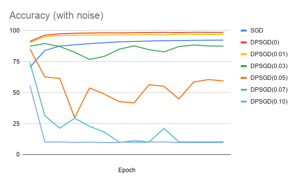
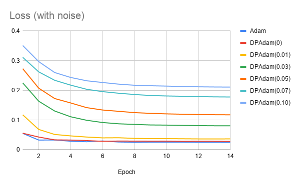
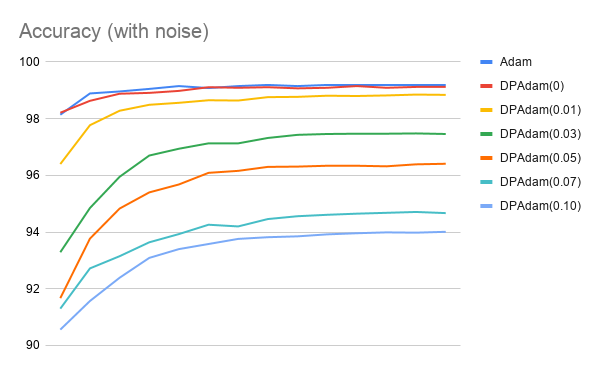

# BlurNN - Machine Learning with Differential Privacy

BlurNN is a pytorch-based model privacy-preserving module.
Two kinds of mechanisms are included, optimizers with differential privacy and model sanitizers, and differs from the timing of perturb adjunction.

## Install
``` python setup.py install ```

## Usage
## Optimizers
Check [```here```](https://pytorch.org/docs/1.3.0/optim.html) for ```torch.optim``` usage.
This package extends optimizers in ```torch.optim``` by extra parameters for differential privacy.

### DPSGD
Extended optimizer from [```torch.optim.SGD```](https://pytorch.org/docs/1.3.0/_modules/torch/optim/sgd.html).
Implements sanitizer in [Deep Learning with Differential Privacy](https://arxiv.org/abs/1607.00133).

``` blurnn.optim.DPSGD(params, lr=<required parameter>, momentum=0, dampening=0, weight_decay=0, nesterov=False, noise_scale=0, norm_bound=0) ```

#### Extra Parameters
* norm_bound (float, optional) - gradient cliping bound (```gradient * argmax(norm_bound, norm(gradient))```)
* noise_scale (float, optional) - gaussian noise with standard deviation ```noise_scale * norm_bound``` is added to each clipped gradient

#### Usage
```
>>> optimizer = dp_optim.SGD(model.parameters(), lr=0.1, momentum=0.9, noise_scale=0.01, norm_bound=1.5)
>>> optimizer.zero_grad()
>>> loss_fn(model(input), target).backward()
>>> optimizer.step()
```

### Performance
Following graphs are comparison of loss and accuracy during epochs using different optimizers over MNIST.




### DPAdam
``` blurnn.optim.DPAdam(params, lr=0.001, betas=(0.9, 0.999), eps=1e-08, weight_decay=0, amsgrad=False, noise_scale=0, norm_bound=0) ```

#### Usage
```
>>> optimizer = dp_optim.DPAdam(model.parameters(), noise_scale=0.01, norm_bound=1.5)
>>> optimizer.zero_grad()
>>> loss_fn(model(input), target).backward()
>>> optimizer.step()
```

### Performance
Following graphs are comparison of loss and accuracy during epochs using different optimizers over MNIST.




## Model Sanitizer
### ModelSanitizer
Implement Sparse Vector Technique(SVT) to obtain ```(eps1 + eps2 + eps3)-differential privacy```
Reference [```Privacy-preserving Federated Brain Tumour Segmentation```](https://arxiv.org/abs/1910.00962)

#### Parameters
* epochs (int): 
* eps1 (float):
* eps2 (float, optional): default: ```(2 * release_proportion * sensitivity) ^ (2/3) * eps1```
* eps3 (float):
* release_proportion (float, optional): the proportion of model to be shared.  release_proportion should be in range [0,1), default: 0.4
* sensitivity (float, optional): default: 1
* gamma (float, optional): the bound default: 0.5
* tau (float, optional): default: 0.1

#### Usage
```
>>> sanitizer = ModelSanitizer(epochs=N, eps1=0.001, eps3=0.001)
>>> sanitizer.base_model = model
>>> for epoch in range(N):
>>>     training...
>>>     testing...
>>>     step...
>>> sanitizer.sanitize(model)
```

## License
The MIT License
